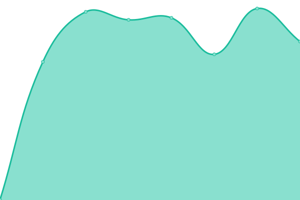

# [📈 Live Status](https://status.weoja.dev): <!--live status--> **🟩 All systems operational**

This repository contains the open-source uptime monitor and status page for [Binh](ntbinh.me), powered by [Upptime](https://github.com/upptime/upptime).

With [Upptime](https://upptime.js.org), you can get your own unlimited and free uptime monitor and status page, powered entirely by a GitHub repository. We use [Issues](https://github.com/iBinh/weoja-status/issues) as incident reports, [Actions](https://github.com/iBinh/weoja-status/actions) as uptime monitors, and [Pages](https://status.weoja.dev) for the status page.

<!--start: status pages-->
<!-- This summary is generated by Upptime (https://github.com/upptime/upptime) -->
<!-- Do not edit this manually, your changes will be overwritten -->
<!-- prettier-ignore -->
| URL | Status | History | Response Time | Uptime |
| --- | ------ | ------- | ------------- | ------ |
|  [Weoja Search](https://weoja.com) | 🟩 Up | [weoja-search.yml](https://github.com/Weoja/weoja-status/commits/HEAD/history/weoja-search.yml) | 

 1132ms
     
 | 

<a href="https://status.weoja.dev/history/weoja-search">99.56%</a>
    

|  [Weoja APIs](https://api.weoja.com/v1/health) | 🟩 Up | [weoja-ap-is.yml](https://github.com/Weoja/weoja-status/commits/HEAD/history/weoja-ap-is.yml) | 

 156ms
     
 | 

<a href="https://status.weoja.dev/history/weoja-ap-is">99.38%</a>
    

|  [Weoja Map](https://map.weoja.com) | 🟩 Up | [weoja-map.yml](https://github.com/Weoja/weoja-status/commits/HEAD/history/weoja-map.yml) | 

 943ms
     
 | 

<a href="https://status.weoja.dev/history/weoja-map">100.00%</a>
    

|  [Weoja Accounts](https://accounts.weoja.com) | 🟩 Up | [weoja-accounts.yml](https://github.com/Weoja/weoja-status/commits/HEAD/history/weoja-accounts.yml) | 

 740ms
     
 | 

<a href="https://status.weoja.dev/history/weoja-accounts">99.84%</a>
    

|  [Weoja Services](https://ip-details.weoja.dev/) | 🟩 Up | [weoja-services.yml](https://github.com/Weoja/weoja-status/commits/HEAD/history/weoja-services.yml) | 

 771ms
     
 | 

<a href="https://status.weoja.dev/history/weoja-services">100.00%</a>
    

|  [Weoja Job](https://job.weoja.dev) | 🟩 Up | [weoja-job.yml](https://github.com/Weoja/weoja-status/commits/HEAD/history/weoja-job.yml) | 

 142ms
     
 | 

<a href="https://status.weoja.dev/history/weoja-job">100.00%</a>
    

|  [Weoja Bot](https://bot.weoja.com) | 🟩 Up | [weoja-bot.yml](https://github.com/Weoja/weoja-status/commits/HEAD/history/weoja-bot.yml) | 

 877ms
     
 | 

<a href="https://status.weoja.dev/history/weoja-bot">100.00%</a>
    

<!--end: status pages-->

[**Visit our status website →**](https://status.weoja.dev)

## 📄 License

- Powered by: [Upptime](https://github.com/upptime/upptime)
- Code: [MIT](./LICENSE) © [Binh](ntbinh.me)
- Data in the `./history` directory: [Open Database License](https://opendatacommons.org/licenses/odbl/1-0/)
