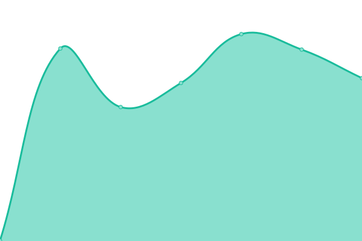
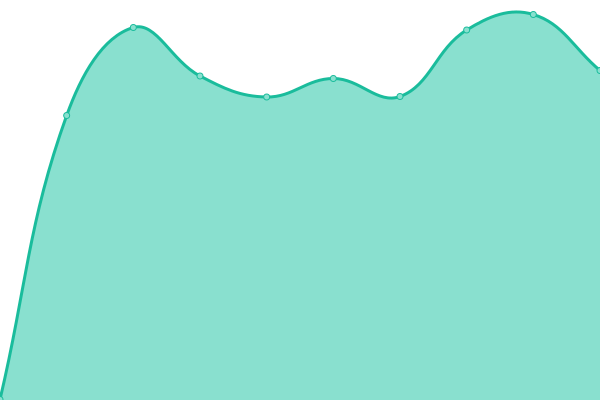
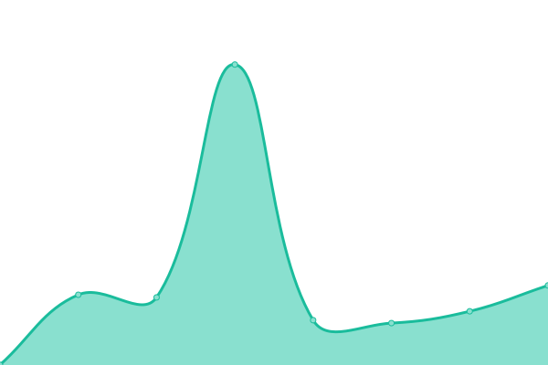
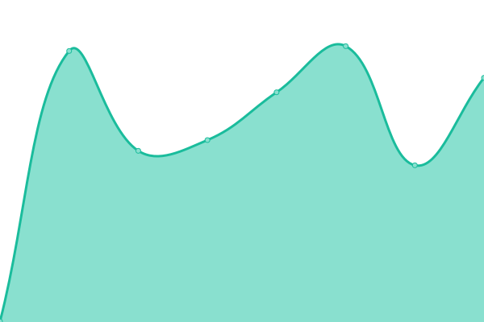
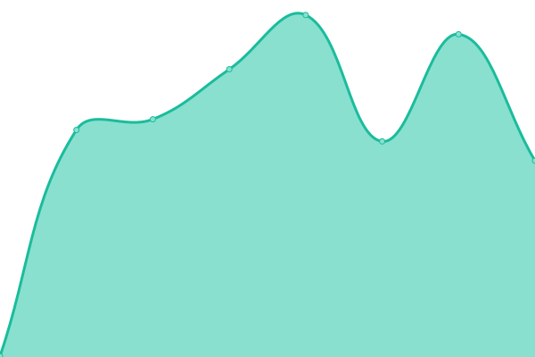
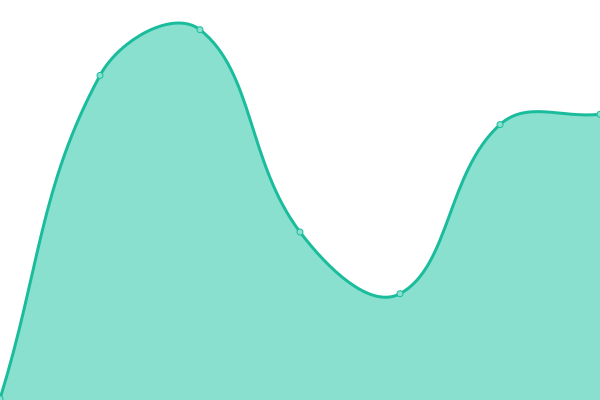
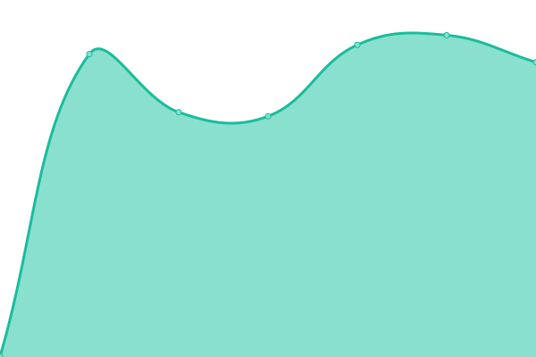

# [📈 Live Status](https://status.weoja.dev): <!--live status--> **🟧 Partial outage**

This repository contains the open-source uptime monitor and status page for [Binh](ntbinh.me), powered by [Upptime](https://github.com/upptime/upptime).

With [Upptime](https://upptime.js.org), you can get your own unlimited and free uptime monitor and status page, powered entirely by a GitHub repository. We use [Issues](https://github.com/iBinh/weoja-status/issues) as incident reports, [Actions](https://github.com/iBinh/weoja-status/actions) as uptime monitors, and [Pages](https://status.weoja.dev) for the status page.

<!--start: status pages-->
<!-- This summary is generated by Upptime (https://github.com/upptime/upptime) -->
<!-- Do not edit this manually, your changes will be overwritten -->
<!-- prettier-ignore -->
| URL | Status | History | Response Time | Uptime |
| --- | ------ | ------- | ------------- | ------ |
|  [Weoja Search](https://weoja.com) | 🟥 Down | [weoja-search.yml](https://github.com/Weoja/weoja-status/commits/HEAD/history/weoja-search.yml) | 

 1763ms
     
 | 

<a href="https://status.weoja.dev/history/weoja-search">100.00%</a>
    

|  [Weoja API VN](https://api.weoja.com/v1/health) | 🟩 Up | [weoja-api-vn.yml](https://github.com/Weoja/weoja-status/commits/HEAD/history/weoja-api-vn.yml) | 

 1318ms
     
 | 

<a href="https://status.weoja.dev/history/weoja-api-vn">99.77%</a>
    

|  [Weoja API DE](https://api-de.weoja.com/v1/health) | 🟩 Up | [weoja-api-de.yml](https://github.com/Weoja/weoja-status/commits/HEAD/history/weoja-api-de.yml) | 

 1114ms
     
 | 

<a href="https://status.weoja.dev/history/weoja-api-de">98.55%</a>
    

|  [Weoja API IN](https://api-in.weoja.com/v1/health) | 🟩 Up | [weoja-api-in.yml](https://github.com/Weoja/weoja-status/commits/HEAD/history/weoja-api-in.yml) | 

 819ms
     
 | 

<a href="https://status.weoja.dev/history/weoja-api-in">98.84%</a>
    

|  [Weoja API SG](https://api-sg.weoja.com/v1/health) | 🟩 Up | [weoja-api-sg.yml](https://github.com/Weoja/weoja-status/commits/HEAD/history/weoja-api-sg.yml) | 

 958ms
     
 | 

<a href="https://status.weoja.dev/history/weoja-api-sg">98.84%</a>
    

|  [Weoja API US](https://api-us.weoja.com/v1/health) | 🟩 Up | [weoja-api-us.yml](https://github.com/Weoja/weoja-status/commits/HEAD/history/weoja-api-us.yml) | 

 526ms
     
 | 

<a href="https://status.weoja.dev/history/weoja-api-us">98.98%</a>
    

|  [Weoja API JP](https://api-jp.weoja.com/v1/health) | 🟩 Up | [weoja-api-jp.yml](https://github.com/Weoja/weoja-status/commits/HEAD/history/weoja-api-jp.yml) | 

 767ms
     
 | 

<a href="https://status.weoja.dev/history/weoja-api-jp">99.44%</a>
    

|  [Weoja API CN](https://api-cn.weoja.com/v1/health) | 🟩 Up | [weoja-api-cn.yml](https://github.com/Weoja/weoja-status/commits/HEAD/history/weoja-api-cn.yml) | 

 2080ms
     
 | 

<a href="https://status.weoja.dev/history/weoja-api-cn">99.81%</a>
    

|  [Weoja API UK](https://api-uk.weoja.com/v1/health) | 🟩 Up | [weoja-api-uk.yml](https://github.com/Weoja/weoja-status/commits/HEAD/history/weoja-api-uk.yml) | 

 689ms
     
 | 

<a href="https://status.weoja.dev/history/weoja-api-uk">99.09%</a>
    

|  [Weoja API FR](https://api-fr.weoja.com/v1/health) | 🟩 Up | [weoja-api-fr.yml](https://github.com/Weoja/weoja-status/commits/HEAD/history/weoja-api-fr.yml) | 

 996ms
     
 | 

<a href="https://status.weoja.dev/history/weoja-api-fr">98.98%</a>
    

|  [Weoja API NL](https://api-nl.weoja.com/v1/health) | 🟩 Up | [weoja-api-nl.yml](https://github.com/Weoja/weoja-status/commits/HEAD/history/weoja-api-nl.yml) | 

 730ms
     
 | 

<a href="https://status.weoja.dev/history/weoja-api-nl">99.24%</a>
    

|  [Weoja API CA](https://api-ca.weoja.com/v1/health) | 🟩 Up | [weoja-api-ca.yml](https://github.com/Weoja/weoja-status/commits/HEAD/history/weoja-api-ca.yml) | 

 629ms
     
 | 

<a href="https://status.weoja.dev/history/weoja-api-ca">99.45%</a>
    

|  [Weoja API KR](https://api-kr.weoja.com/v1/health) | 🟩 Up | [weoja-api-kr.yml](https://github.com/Weoja/weoja-status/commits/HEAD/history/weoja-api-kr.yml) | 

 694ms
     
 | 

<a href="https://status.weoja.dev/history/weoja-api-kr">99.65%</a>
    

|  [Weoja Map](https://map.weoja.com) | 🟩 Up | [weoja-map.yml](https://github.com/Weoja/weoja-status/commits/HEAD/history/weoja-map.yml) | 

 845ms
     
 | 

<a href="https://status.weoja.dev/history/weoja-map">100.00%</a>
    

|  [Weoja Accounts](https://accounts.weoja.dev) | 🟩 Up | [weoja-accounts.yml](https://github.com/Weoja/weoja-status/commits/HEAD/history/weoja-accounts.yml) | 

 714ms
     
 | 

<a href="https://status.weoja.dev/history/weoja-accounts">100.00%</a>
    

|  [Weoja Services](https://ip-details.weoja.dev/) | 🟩 Up | [weoja-services.yml](https://github.com/Weoja/weoja-status/commits/HEAD/history/weoja-services.yml) | 

 752ms
     
 | 

<a href="https://status.weoja.dev/history/weoja-services">100.00%</a>
    

|  [Weoja Job](https://job.weoja.dev) | 🟩 Up | [weoja-job.yml](https://github.com/Weoja/weoja-status/commits/HEAD/history/weoja-job.yml) | 

 139ms
     
 | 

<a href="https://status.weoja.dev/history/weoja-job">100.00%</a>
    

|  [Weoja Bot](https://bot.weoja.com) | 🟩 Up | [weoja-bot.yml](https://github.com/Weoja/weoja-status/commits/HEAD/history/weoja-bot.yml) | 

 781ms
     
 | 

<a href="https://status.weoja.dev/history/weoja-bot">100.00%</a>
    

<!--end: status pages-->

[**Visit our status website →**](https://status.weoja.dev)

## 📄 License

- Powered by: [Upptime](https://github.com/upptime/upptime)
- Code: [MIT](./LICENSE) © [Binh](ntbinh.me)
- Data in the `./history` directory: [Open Database License](https://opendatacommons.org/licenses/odbl/1-0/)
